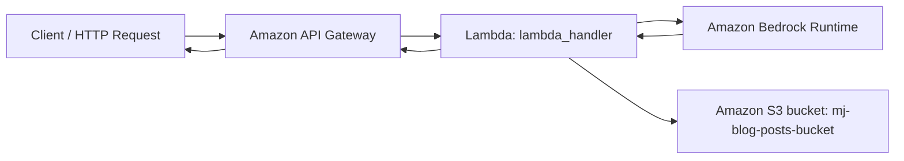

# AWS Blog Generation with Bedrock

Serverless blog generation API built with AWS Lambda, Amazon Bedrock, and Amazon S3.

This project accepts a blog topic, generates a detailed blog post using a Bedrock foundation model, and stores the generated content in S3.

## Features

- Generate blog content from a single input: `blog_topic`
- Uses Amazon Bedrock (`meta.llama3-8b-instruct-v1:0`) for text generation
- Saves generated output to S3 with timestamped file names
- Exposes a REST endpoint through API Gateway

## Project Structure

- `app.py` - Lambda handler and business logic
- `request.http` - Sample request to test deployed API

## Architecture



## Request and Response Flow

1. Client sends a `POST` request with JSON body: `{"blog_topic": "..."}`.
2. API Gateway triggers Lambda (`lambda_handler` in `app.py`).
3. Lambda calls Bedrock `converse()` to generate blog text.
4. Lambda stores generated output in S3 under `blog-output/<timestamp>.txt`.
5. Lambda returns JSON response with status and generated blog content.

## Prerequisites

- AWS account with access to:
  - AWS Lambda
  - Amazon API Gateway
  - Amazon Bedrock (model access enabled for Llama 3)
  - Amazon S3
- Python 3.10+ (recommended for local packaging/testing)
- AWS CLI configured (`aws configure`)

## Required AWS Configuration

### 1) S3 Bucket

Create or use an S3 bucket (currently hardcoded in code as `mj-blog-posts-bucket`).

### 2) Bedrock Model Access

In Amazon Bedrock console:
- Enable access to `meta.llama3-8b-instruct-v1:0` in `us-east-1`.

### 3) Lambda Execution Role Permissions

Attach IAM permissions that allow:
- `bedrock:InvokeModel` and/or Bedrock runtime call permissions
- `s3:PutObject` on target bucket path
- CloudWatch Logs permissions for Lambda logging

## How to Deploy and Execute

### Option A: Deploy in AWS Lambda Console (quickest)

1. Create a new Lambda function (Python runtime).
2. Copy `app.py` code into Lambda.
3. Set handler to:
   - `app.lambda_handler`
4. Ensure region is `us-east-1` (or update code if using another region).
5. Attach IAM role with Bedrock + S3 permissions.
6. Create API Gateway trigger (HTTP API or REST API) for Lambda.
7. Deploy API and note endpoint URL.

### Option B: Package and Upload

If you deploy via zip package:

1. Zip the project code.
2. Upload zip to Lambda.
3. Configure handler as `app.lambda_handler`.
4. Add API Gateway trigger and deploy.

## How to Test

### 1) Using `request.http`

Update endpoint in `request.http` if needed, then run:

```http
POST https://<your-api-id>.execute-api.us-east-1.amazonaws.com/dev/blog-generation
Content-Type: application/json

{
  "blog_topic": "AI in healthcare"
}
```

### 2) Using cURL

```bash
curl -X POST "https://<your-api-id>.execute-api.us-east-1.amazonaws.com/dev/blog-generation" \
  -H "Content-Type: application/json" \
  -d "{\"blog_topic\":\"AI in healthcare\"}"
```

## Expected Response

```json
{
  "message": "Blog generated successfully",
  "blog_details": "....generated content...."
}
```

If `blog_topic` is missing:

```json
{
  "error": "blog_topic is required"
}
```

## Notes and Improvements

- `app.py` asks for a 2000-word blog but `maxTokens` is currently `1000`; adjust if longer output is needed.
- Bucket name is hardcoded. For production, move settings to environment variables.
- Add structured logging and better error details for observability.
- Add authentication/authorization at API Gateway layer before public exposure.

## License

Use any license you prefer before publishing (for example, MIT).
